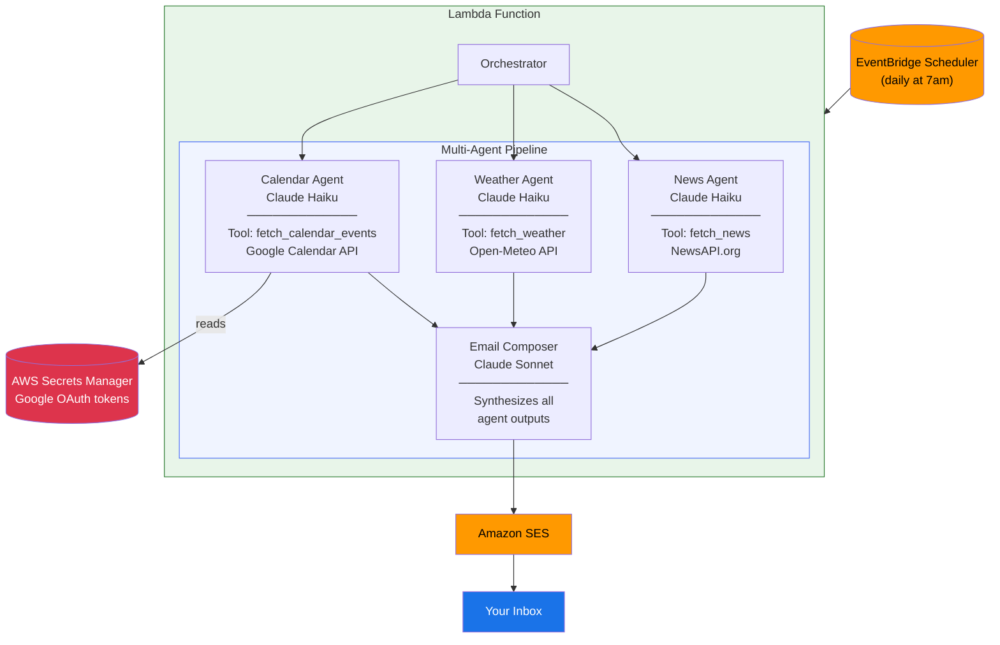

# Daily Briefing Emailer

A multi-agent system that sends you a personalized daily email with today's top news, local weather, and your Google Calendar schedule.

## How it works

Four specialized agents run in sequence, each using the right model for the job:

| Agent | Model | Job |
|---|---|---|
| News Agent | Claude Haiku | Fetches & summarizes top 5 headlines |
| Weather Agent | Claude Haiku | Fetches & formats local weather |
| Calendar Agent | Claude Haiku | Fetches & summarizes your day's events |
| Email Composer | Claude Sonnet | Combines everything into a polished email |

Haiku handles the data-fetching agents (fast and cheap). Sonnet writes the final email (better prose quality). This demonstrates how to use the right model for the right task.

## Architecture



## Prerequisites

1. **Anthropic API key** — set as `ANTHROPIC_API_KEY` in Lambda environment or SSM
2. **NewsAPI key** — free at [newsapi.org](https://newsapi.org) (100 req/day free tier)
3. **AWS account** with SES configured and your sender email verified
4. **Google Calendar API** credentials — optional, see setup below

## Deploy

```bash
cd cdk
python -m venv .venv && source .venv/bin/activate
pip install -r requirements.txt
```

Edit `cdk/cdk.json` with your values, then build the Lambda package and deploy:

```bash
# Build Lambda dependencies for Linux (no Docker required)
pip install --platform manylinux2014_x86_64 --only-binary=:all: \
    --python-version 3.13 --target ../lambda_build \
    -r ../lambda/requirements.txt
cp ../lambda/handler.py ../lambda_build/

# Deploy
npx cdk bootstrap   # first time only
npx cdk deploy
```

### Configuration options (`cdk/cdk.json`)

| Key | Description | Default |
|---|---|---|
| `sender_email` | SES-verified sender address | *(required)* |
| `recipient_email` | Where to send the briefing | *(required)* |
| `news_api_key` | Your NewsAPI.org key | *(required)* |
| `schedule_timezone` | Timezone for the daily trigger | `America/Los_Angeles` |
| `schedule_hour` | Hour to send (24h format) | `7` |
| `lat` / `lon` | Your location coordinates | SF defaults |
| `location_name` | Human-readable location name | `San Francisco, CA` |
| `enable_google_calendar` | Set to `"true"` to enable calendar | `"false"` |

### Setting the Anthropic API key

Add it directly to the Lambda after deploying:

```bash
aws lambda update-function-configuration \
  --function-name DailyBriefingEmailerStack-BriefingFunction \
  --environment "Variables={ANTHROPIC_API_KEY=sk-ant-...}"
```

## Google Calendar Setup (optional)

1. Go to [Google Cloud Console](https://console.cloud.google.com)
2. Create a project → Enable **Google Calendar API**
3. Create **OAuth 2.0 credentials** (Desktop app type) and download the JSON
4. Run the one-time auth script locally to generate tokens:

```bash
pip install google-auth-oauthlib
python scripts/authorize_google.py
```

5. Set `enable_google_calendar` to `"true"` in `cdk.json` and redeploy
6. Store the tokens in the Secrets Manager secret the stack creates:

```bash
aws secretsmanager put-secret-value \
  --secret-id daily-briefing/google-calendar \
  --secret-string '{
    "client_id": "YOUR_CLIENT_ID",
    "client_secret": "YOUR_CLIENT_SECRET",
    "access_token": "YOUR_ACCESS_TOKEN",
    "refresh_token": "YOUR_REFRESH_TOKEN"
  }'
```

## Sample Output

```
Good morning! Here's your briefing for Monday, May 11, 2026.

WEATHER
Currently 62°F and partly cloudy in Newark, CA. Expect morning fog to clear
by noon, with highs near 68°F. Light winds — no jacket needed after 10am.

NEWS
1. Fed holds rates steady amid mixed economic signals — WSJ
2. Senate passes bipartisan infrastructure amendment — AP
3. Apple announces new accessibility features ahead of WWDC — The Verge
4. Scientists identify new deep-sea species off Pacific Coast — Reuters
5. NBA playoffs: Warriors advance to conference finals — ESPN

CALENDAR
- 9:00–9:30am — Standup
- 11:00am–12:00pm — Product review
- 3:00–4:00pm — 1:1 with manager
Free blocks: 9:30–11am, 12–3pm (longest), and after 4pm

Have a great Monday — you've got this!
```
